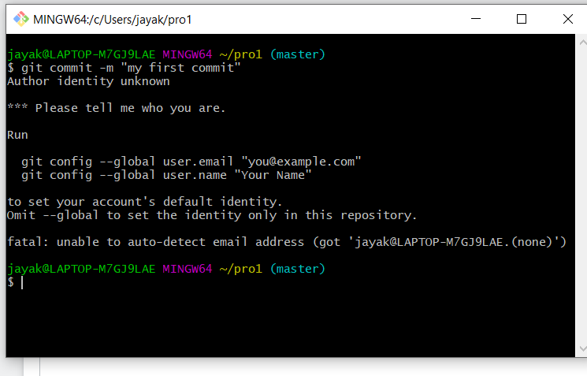

<br />
<br />
<br />

# TOPIC 2: Getting setup with github.io

---

## github.io for publishing

Step 1: Create/login to your github account

notes:
(We'll also do this "live" in the coding section of class)

---

## github.io for publishing

Step 2: Create new repository


---

## github.io for publishing

Step 2: Create new repository


---

## github.io for publishing

Step 3: Name your new repository as ```[username].github.io```


---

## github.io for publishing

Step 3: Name your new repository as ```[username].github.io```


notes: the name is important here!!

---

## github.io for publishing

Step 4: Clone your repository


---

## github.io for publishing

Step 4: Clone your repository


notes: make note of your git name, we'll use this for "cloning" our github repo

---

## github.io for publishing

Step 5: Clone your repository
 * In command line do: ```git clone YOUR_REPO_LINK```

---

## github.io for publishing

Step 5: Clone your repository
 * In command line do: ```git clone YOUR_REPO_LINK```

 #### You might be prompted to add in your credentials:



---

## github.io for publishing

Step 5: Clone your repository
 * In command line do: ```git clone YOUR_REPO_LINK```

 #### You might be prompted to add in your credentials:


See instructions for [setting up your credentials in Git](https://docs.github.com/en/get-started/getting-started-with-git/setting-your-username-in-git).


---

## github.io for publishing

Step 6: In the command line, move into your github.io folder with `cd <GITHUB USER NAME>.github.io`

**Be aware:** you might have to put a full path to "cd" into like `cd /Users/jillnaiman/jnaiman.github.io`

---

## github.io for publishing

Step 6: In the command line, move into your github.io folder with `cd <GITHUB USER NAME>.github.io`

Be aware: you might have to put a full path to "cd" into like `cd /Users/jillnaiman/jnaiman.github.io`

Step 7: Add an `index.html` file to this new folder (download via the link in Lab \#4).


---

## github.io for publishing

Step 8: Add files to your repo officially
 * ```git add -A```
 
Step 9: Commit these files (say what you are doing)
 * ```git commit -m "my first add"```
 
Step 10: Push to your online repo
 * ```git push```
 
Step 11: wait for your website to build and then check it out!
 * Link: ```https://YOUR_GITHUB_USER_NAME.github.io/```


---

## github.io for publishing

Step 8: Add files to your repo officially
 * ```git add -A```
 
Step 9: Commit these files (say what you are doing)
 * ```git commit -m "my first add"```
 
Step 10: Push to your online repo
 * ```git push```
 
Step 11: wait for your website to build and then check it out!
 * Link: ```https://YOUR_GITHUB_USER_NAME.github.io/```
 
**You can also use the GUI interface for this if you want!**

An example from a DPI talk Prof. Turk and I gave [can be found right here](https://mediaspace.illinois.edu/media/t/1_a874v3q7).

notes:
you can also use the GUI interface to do this if you are more comfortable with that

---

## github.io for publishing


notes:
you'll get some feedback instantaneously as well as your grade

---

## github.io for publishing


notes:
one final thing -- be sure you use the index.html file linked here in your lab instance!


---

## More info:

[https://pages.github.com/](https://pages.github.com/)


---

## Some things to keep in mind

 * You might have to set up a personal access token, see: https://docs.github.com/en/authentication/keeping-your-account-and-data-secure/creating-a-personal-access-token
 * You might have to specify a "branch" to build from: on your github.io code page go to Settings -> Pages and select "Branch:master"/"Branch:main" under "Source"


---

## Next week -- "flipped" class for Lab \#5

In particular, I am assuming you have watched the [Part 2 Video](https://mediaspace.illinois.edu/media/t/1_k93hei8q) already before joining the class next week (video on Module page) *and* have looked at the prep notebook in Week 6.

**We will spend the majority of class next week with time to work on Lab \#5.**

**(Yes, this is a hint that Lab \#5 is a tough one!)**

notes:
this is just a reminder!

---

# To Python for more interactivity!

---
