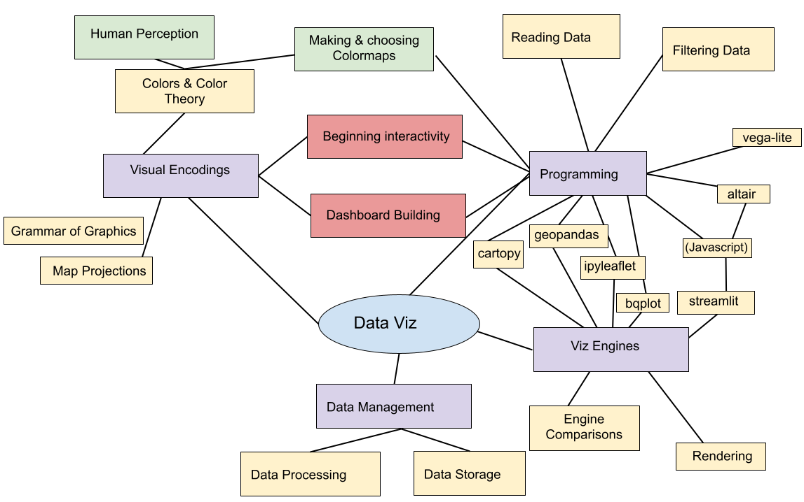

## Last Week

notes:
last week we discussed maps and mappable data

---

## This Week

notes: 
this week we'll start working toward some tools we'll use to start hosting some interactive viz on the web.

Luckily, will all of our usage of bqplot and grammar of graphics we are well equipt to do this!

in previous iterations of the class we used online notebook hosts called Iodide or Starboard to do this, but it is no longer supported so we are going to use a different method called ~~Starboard~~ Streamlit which we'll then host on Huggingface.

I've kept some of the links to old Iodide/Starboard prep notebooks in the extended resources in case you are curious, but it will be very similar to stuff we will be doing using ~~Starboard~~ Streamlit

---

## Today

 1. Choosing your viz
 1. Intro to Vega/Vega-lite
 1. Intro to Vega-lite in Altair
 1. ~~Iodide~~ ~~Starboard~~ Streamlit (if time)

---

 
 
 

# TOPIC 1: Choosing your viz

notes:
we've gone through a bunch of different sorts of viz, so its worth taking a moment to think about which kind to use in each instance

---

## Composition

Don't use a pie chart.

<!-- .slide: data-background-image="images/piechart.png" data-background-size="auto 65%" data-background-position="right 50% bottom 50%" -->

notes:
pie charts force you to analyze things by area or angle, which are multidimensional attributes that are easy to confuse.

which is the most popular zoo animal in this pie chart? Elephants, otters, or lions?

---

## Composition

Don't use a pie chart.

<!-- .slide: data-background-image="images/piechartlabels.png" data-background-size="auto 65%" data-background-position="right 50% bottom 50%" -->

notes:
we can make a marginal improvement by labeling the values.

But we wouldn't be doing visualization if we were interested in just reading text.

---

## Composition

Don't use a pie chart.

<!-- .slide: data-background-image="images/3dpiechart.png" data-background-size="auto 65%" data-background-position="right 50% bottom 50%" -->

notes:
And if 2-dimensional area is difficult to understand, then 3-dimensional volume is even worse. 

3 dimensional values violate the principle of proportional ink, which states that:

 The sizes of shaded areas in a visualization need to be proportional to the data values they represent. 

---

## Alternatives

<!-- .slide: data-background-image="images/donutchart.png" data-background-size="auto 65%" data-background-position="right 50% bottom 50%" -->

notes:
Some people will try to sell you on a modified version of a pie chart called a donut chart that has a hole in the middle. This is a slight improvement because it helps you see the values in the circle as 1-dimensional arc length instead of area. 

But circles are still hard to decipher.

---

## Alternatives

<!-- .slide: data-background-image="images/treemap.png" data-background-size="auto 65%" data-background-position="right 50% bottom 50%" -->

notes:
We can reduce some of the confusion associated with using circles by creating proportional *rectangular* area. Now we can compare along the dimensions of height and width for certain values.

But area is still problematic because it asks us to compare two dimensions - width and height - simultaneously.

---

## Alternatives

<!-- .slide: data-background-image="images/barchart.png" data-background-size="auto 65%" data-background-position="right 50% bottom 50%" -->

notes:
you can show comparitive values more effectively with a bar chart though. These values are easily compared along just one dimension.

---

## Alternatives

<!-- .slide: data-background-image="images/waterfallchart.png" data-background-size="auto 65%" data-background-position="right 50% bottom 50%" -->

notes:
there are really quite a few alternatives. There are many ways to show data stacking up progressively. This waterfall chart shows how each value is part of a whole, which was sort of the idea of the pie chart.

---

## Comparison

<!-- .slide: data-background-image="images/columnchart.png" data-background-size="auto 65%" data-background-position="right 50% bottom 50%" -->

notes:
to compare values from multiple sources, you could use collected columns

---

## Comparison

<!-- .slide: data-background-image="images/stackedcolumnchart.png" data-background-size="auto 65%" data-background-position="right 50% bottom 50%" -->

notes:
Or to show they're part of a whole, use a stacked column chart

I personally find these a bit hard to decifer, but other viz folks like them a lot -- might be a personal choice type thing.

---

## Comparison

<!-- .slide: data-background-image="images/stackedareachart.png" data-background-size="auto 65%" data-background-position="right 50% bottom 50%" -->

notes:
or to show a time-series, use connected lines that stack on top of each other to show area across the whole canvass. This shows you trends and specific vertical values.

same issues with this here as far as stacking, but again, people like it!

---

## Comparison

JUST NOT THIS!

notes:
Just do not compare pie charts!

Zomygod what is even happening right now.

---

## Hierarchical data

<!-- .slide: data-background-image="images/hierarchical_zoos.png" data-background-size="auto 65%" data-background-position="right 50% bottom 50%" -->

notes:
Sometimes we want to show data in a proportion and show connections.
This often happens for hierarchical data.

Here in this example we want to show proportions of land based mammals that
are popular at the zoo and then as we move out we subdivide by the individual
animal species.

---

## Hierarchical data: example packages

 * Sunbursts (e.g., [snakeviz](https://jiffyclub.github.io/snakeviz/) )
 * Nested box area (e.g., [callgrind](https://kcachegrind.github.io/html/Home.html) ) - for
 showing flowchart like structures for things like code programs

<table>
<tr>
<td>
</td><td></td>
</tr>
</table>

notes:
For hierarchical data, you can nest some of these other formats.

