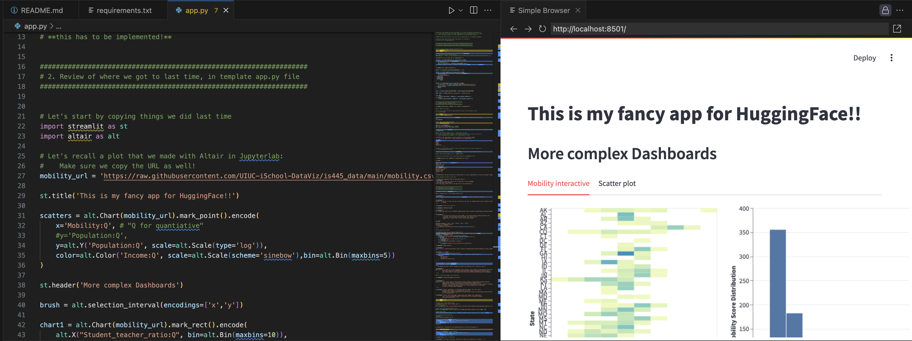
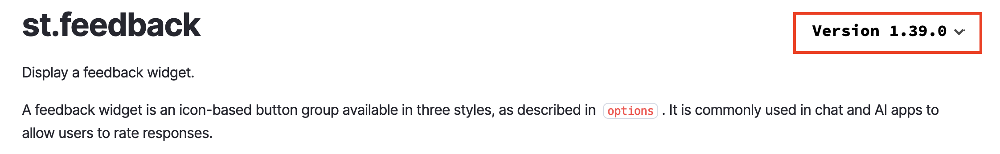

## Sharing Streamlit Apps

Today we will work on sharing our Streamlit apps with the public using HuggingFace.

(and continue adding some features)

notes:
so far we've been building streamlit apps locally (or on PL) but we don't have a way to share this with our adoring public :D

we'll talk more about this today

---

## The `app.py` file



notes:
so far we've really been looking at one file -- the app.py file

this is where we right the majority of our code that makes plots and interactive elements for us

but there are other files that we need to be concerned with when building an app

---

## The `README.md` file

```yaml
---
title: Prep notebook -- My Streamlit App (Day 1)
emoji: 🏢
colorFrom: blue
colorTo: gray
sdk: streamlit
sdk_version: 1.39.0
app_file: app.py
pinned: false
license: mit
---
```

notes:
in particular, we need to worry about the top part of our README.md file as this says some important things!

---

## The `README.md` file

```yaml
---
title: Prep notebook -- My Streamlit App (Day 1) <-- title of page
emoji: 🏢
colorFrom: blue
colorTo: gray
sdk: streamlit
sdk_version: 1.39.0
app_file: app.py
pinned: false
license: mit
---
```

notes:
our title is the title of our page

---

## The `README.md` file

```yaml
---
title: Prep notebook -- My Streamlit App (Day 1) <-- title of page
emoji: 🏢 
colorFrom: blue 
colorTo: gray
sdk: streamlit <-- what code base to use
sdk_version: 1.39.0
app_file: app.py
pinned: false
license: mit
---
```

notes:
this says we want to use streamlit to build our app -- there are other app-building software on HF, but we will focus on streamlit

---

## The `README.md` file

```yaml
---
title: Prep notebook -- My Streamlit App (Day 1) <-- title of page
emoji: 🏢 
colorFrom: blue 
colorTo: gray
sdk: streamlit <-- what code base to use
sdk_version: 1.39.0 <-- what version of Streamlit **IMPORTANT**
app_file: app.py
pinned: false
license: mit
---
```

notes:
this says what version we want to use

*this is important!*

not all widgets are supported in all versions

---

## The `README.md` file

```yaml
---
title: Prep notebook -- My Streamlit App (Day 1) <-- title of page
emoji: 🏢 
colorFrom: blue 
colorTo: gray
sdk: streamlit <-- what code base to use
sdk_version: 1.39.0 <-- what version of Streamlit **IMPORTANT**
app_file: app.py
pinned: false
license: mit
---
```

For example, the [feedback widget](https://docs.streamlit.io/develop/api-reference/widgets/st.feedback) only works with the newest version.



notes:
for example the "feedback" widget that we will play with is only supported in the newest version -- you can check this by going to the streamlit widget page and using the highlighted dropdown to check the version.

---

## The `README.md` file

```yaml
---
title: Prep notebook -- My Streamlit App (Day 1) <-- title of page
emoji: 🏢 
colorFrom: blue 
colorTo: gray
sdk: streamlit <-- what code base to use
sdk_version: 1.39.0 <-- what version of Streamlit **IMPORTANT**
app_file: app.py <-- which file is our "main" app file
pinned: false
license: mit
---
```


notes:
finally, our main file -- we can change the name of where we are doing our development as long as we point to the correct file in the README.md file

---

## The `requirements.txt` file

```yaml
streamlit==1.39.0
altair
numpy
pandas
matplotlib
```

notes:
we also have to include one more file -- the requirements.txt file

this contains all of the packages that need to be installed for our app to work

HF needs to know about these packages so it knows what it needs to install before running your app

---

## HuggingFace Strategies

For new apps, the easiest way to build is to start by a "similar enough" app and duplicate it.

---

## HuggingFace Strategies

For new apps, the easiest way to build is to start by a "similar enough" app and duplicate it.

Good news! You already did this in Lab 6!

---

## HuggingFace Strategies

For new apps, the easiest way to build is to start by a "similar enough" app and duplicate it.

Good news! You already did this in Lab 6!

You can also search [HuggingFace Spaces for Streamlit Apps](https://huggingface.co/spaces?sort=trending&search=streamlit) for others.